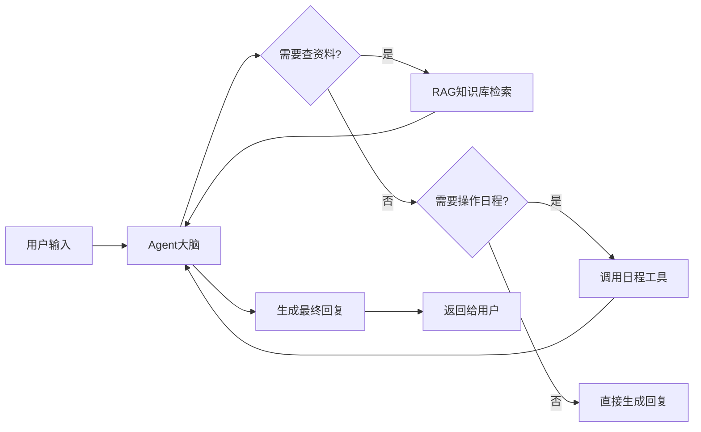

# 智能日程管理助手

为解决个人及团队在日程管理中手动输入效率低下、容易遗忘且频繁发生时间冲突的问题，开发了一款智能日程管理助手。设计并实现一个能够理解自然语言输入、自动同步至第三方日历平台、并提供智能冲突检测与安排建议的系统

## 产品定位

**一句话介绍**：一款用自然语言交互的AI日程管理助手，让用户像跟助理说话一样管理日程。

**目标用户**：
- 核心用户：日常会议、课程、DDL频繁的大学生和职场新人
- 扩展用户：需要多人日程协调的小团队

**核心价值**：
- 传统日历工具需要手动填写表单，操作繁琐，缺乏智能提醒
- 本产品通过AI Agent，实现“说人话就能管日程”，并主动帮用户发现和解决时间冲突

## 用户场景

**场景1：快速创建日程**
> “明天下午3点到5点跟导师开会” → 系统自动解析时间、事件，一键创建日程，无需手动选日期、填表单。

**场景2：智能冲突检测**
> 用户想安排一个新会议，但当天已有两个会议。系统检测到时间重叠，主动提示“您当天14:00-16:00已有会议，建议改为16:30-17:30”。

**场景3：上下文记忆**
> 用户上周跟AI讨论过“下周三有个论文答辩”，本周问“我周三有什么安排？”AI能记住之前的对话上下文，准确回答。

## 核心产品策略

### 意图分类体系
我们将用户的自然语言输入分为5类意图：
| 意图类型 | 示例 | 产品策略 |
|---------|------|---------|
| 明确日程创建 | “明天下午3点开会” | 直接解析并创建，回复确认 |
| 模糊需求探索 | “帮我看看下周有没有空” | 先查询再建议，提供多个选项 |
| 日程修改 | “把明天的会改到后天” | 识别修改意图，确认后更新 |
| 日程查询 | “周五有什么安排” | 快速检索并呈现 |
| 闲聊/其他 | “今天天气真好” | 友好回应，不强行执行操作 |

**设计考量**：区分“明确”和“模糊”意图，是为了避免信息不足时强行执行，导致错误创建。模糊场景下先追问再执行，提升准确率和用户信任。
```mermaid

graph TD
A[用户输入自然语言] --> B{意图识别}

    B -->|明确创建日程| C{参数是否完整?}
    B -->|模糊需求探索| D[追问补全意图]
    B -->|日程查询| E[查询日程数据]
    B -->|日程修改/取消| F[确认操作意图]
    B -->|闲聊/其他| G[友好回复]
    
    D --> C
    
    C -->|参数完整| H{冲突检测}
    C -->|参数不足| I[追问补全参数]
    I --> C
    
    H -->|Severe 重叠冲突| J[阻断创建+推荐可用时段]
    H -->|Moderate 相邻冲突| K[高亮提醒+询问是否继续]
    H -->|Minor 缓冲冲突| L[弱提示+允许创建]
    H -->|无冲突| M[直接创建日程]
    
    J --> N[生成回复]
    K --> N
    L --> N
    M --> N
    E --> N
    F --> N
    G --> N
    
    N --> O[结果返回给用户]
  ```
### 三级冲突检测策略
传统日历只判断“时间重叠”，我们设计了更细颗粒度的冲突分级：

| 冲突等级 | 判定条件 | 产品行为 | 设计理由 |
|---------|---------|---------|---------|
| **Minor** | 行程间隔<15分钟 | 弱提示“行程较紧凑” | 不阻断操作，避免过度打扰 |
| **Moderate** | 行程首尾相接 | 高亮提醒，由用户决策 | 涉及通勤时间，需要强提醒但不强制 |
| **Severe** | 时间明确重叠 | 阻断创建，自动推荐最近3个可用时段 | 硬冲突必须阻断，并提供替代方案 |

**设计考量**：分级的本质是根据“用户损失程度”匹配“系统干预强度”。Severe阻断是为了防止用户出错，Minor弱提示是为了不过度打扰。这个设计来自于对真实日程场景的观察——不是所有冲突都应该被一视同仁。

### 双模记忆方案
为什么设计短期+长期记忆，而不是只用一种？

| 记忆类型 | 存储方案 | 容量 | 访问速度 | 用途 |
|---------|---------|------|---------|------|
| 短期记忆 | Redis缓存 | 最近20轮对话 | <10ms | 保证对话流畅，上下文连续 |
| 长期记忆 | MySQL持久化 | 全量历史 | 正常 | 支持用户回溯历史，构建长期偏好 |

**产品决策**：直接用大模型的“长上下文窗口”存储所有历史，Token成本太高（1次对话可能消耗数万Token）。双模方案在体验和成本间取得了平衡——高频访问的历史走缓存，低频回溯的走数据库。

## 产品验证

### 当前阶段
产品处于MVP验证阶段，已完成核心功能的开发与自测。

### 待收集的关键指标
| 指标类型 | 具体指标 | 为什么重要 |
|---------|---------|-----------|
| 核心体验 | 日程创建成功率 | 衡量自然语言解析的准确度 |
| 留存 | 周活跃用户数 | 日程管理是高频场景，周活反映真实使用 |
| 功能价值 | 冲突检测触发率 & 建议采纳率 | 验证冲突检测策略是否真正有用 |
| 体验 | 平均对话轮次 | 轮次过多说明意图识别不够精准 |

### 后续验证计划
1. 邀请10-15名目标用户进行试用
2. 收集用户反馈，重点关注：冲突检测合理性、对话流畅度、遗漏的功能
3. 基于反馈迭代，优化意图识别和冲突策略

## 项目主要功能

- **自然语言日程管理**：用户可以通过自然语言创建、查询、修改和取消日程安排，无需手动填写复杂表单
- **智能日程识别与解析**：系统能够自动识别用户输入中的时间、地点、事件等关键信息并转化为结构化日程数据
- **多平台日历同步**：支持与主流日历平台（如Google Calendar、Outlook等）进行数据同步，保持日程一致性
- **智能冲突检测**：自动检测新日程与现有日程的时间冲突，并提供冲突提醒和解决方案建议
- **AI对话交互**：集成通义千问大模型，通过自然对话方式管理日程，提供智能助手服务
- **会话管理**：支持多会话管理，用户可以针对不同场景或项目进行独立的对话和日程管理
- **用户认证与授权**：提供安全的用户注册登录机制，确保用户数据隐私和安全
- **文档知识库支持**：支持上传文档并构建知识库，使AI能够基于文档内容回答问题（RAG功能）

## 技术栈

### 后端技术栈
- **框架**：Java Spring Boot 3.x
- **数据库**：
  - MySQL 8.0+（关系数据存储）
  - Redis 7.0+（向量数据存储，基于普通Redis实现）
- **AI服务**：通义千问（DashScope API）
- **认证机制**：JWT (JSON Web Token)
- **构建工具**：Maven 3.8+
- **API文档**：OpenAPI 3.0
- **向量计算**：余弦相似度算法
- **文档解析**：Apache Tika

### 前端技术栈
- **框架**：Vue.js 3 + Composition API
- **UI组件库**：Element Plus
- **构建工具**：Vite
- **HTTP客户端**：Axios
- **状态管理**：Pinia
- **路由**：Vue Router 4

### 开发环境要求
- **Java**：JDK 17+
- **Node.js**：18.0+
- **数据库**：MySQL 8.0+，Redis 7.0+
- **操作系统**：Windows/Linux/macOS

## 项目演示图片

> 演示图片将在后续版本中补充

## 在线演示地址

> 在线演示地址将在后续版本中提供

## 核心功能详解

### 1. 用户认证系统
系统使用JWT进行用户认证，用户需要先注册账号并登录获取访问令牌，后续所有API请求都需要携带该令牌。

**主要接口：**
- `POST /api/auth/signin` - 用户登录
- `POST /api/auth/signup` - 用户注册

### 2. 日程管理
用户可以通过自然语言与AI助手交互来管理日程，也可以通过传统API接口直接操作日程数据。系统支持创建、查询、修改、取消和删除日程。

**主要接口：**
- `GET /booking/list` - 获取用户日程列表
- `POST /api/conflict/check` - 检测日程冲突
- `POST /api/conflict/suggestions` - 获取智能时间建议

### 3. 智能冲突检测
当用户创建新日程时，系统会自动检测该日程是否与现有日程存在时间冲突，并提供冲突详情和解决方案建议。支持单日和多日冲突检测，基于时间重叠算法实现。

**冲突检测特性：**
- 时间重叠检测
- 相邻时间检测
- 连续事件检测
- 智能时间建议

### 4. AI对话交互
系统集成了通义千问大模型，用户可以通过自然语言与AI助手进行交互，AI助手能够理解用户意图并调用相应的函数来执行日程管理操作。

**主要接口：**
- `POST /ai/generateStreamAsString` - AI流式响应生成
- 支持RAG检索增强
- 函数调用能力

### 5. 会话管理
系统支持多会话管理，用户可以为不同场景或项目创建独立的对话会话，便于组织和查找历史对话记录。

**主要接口：**
- `POST /api/conversations/new` - 创建新对话
- `GET /api/conversations/recent-session` - 获取最近活动会话
- `GET /api/conversations/session/{sessionId}/exists` - 检查会话是否存在
- `GET /api/conversations/session/{sessionId}/count` - 获取会话对话数量
- `GET /api/conversations/sessions/summaries/current` - 获取当前用户会话总结

### 6. 文档知识库（RAG）
系统支持上传各种格式的文档（如PDF、Word、Excel等），通过Apache Tika解析文档内容，并将其存储在Redis向量数据库中。当用户提问时，系统会检索相关文档内容，使AI能够基于文档内容提供更准确的回答。

**主要接口：**
- `POST /api/documents/embedding` - 文档向量化嵌入
- `POST /api/documents/query` - 向量数据库查询

**技术特点：**
- 基于普通Redis的向量存储方案
- 余弦相似度搜索算法
- 支持多种文档格式
- 持久化存储，重启后数据不丢失

## API接口文档

项目提供完整的OpenAPI 3.0规范文档，位于 `docs/api/openapi.yaml`。该文档详细描述了所有API接口的请求参数、响应格式和错误码。

**主要API分类：**
- **认证接口**：用户注册、登录、令牌管理
- **对话管理**：会话创建、消息记录、会话总结
- **冲突检测**：日程冲突检测、智能时间建议
- **文档管理**：文档嵌入、向量查询
- **AI交互**：自然语言处理、流式响应

**API认证方式：**
所有受保护的API都需要在请求头中添加Bearer Token：
```
Authorization: Bearer {jwt_token}
```

## 项目架构说明

### 后端架构（Spring Boot）
```
src/main/java/
├── controller/           # 控制器层
│   ├── AuthController.java          # 用户认证
│   ├── ConversationController.java  # 对话管理
│   ├── ConflictDetectionController.java # 冲突检测
│   ├── OpenAiController.java        # AI交互
│   ├── DocumentController.java      # 文档管理
│   └── BookingController.java       # 日程管理
├── service/             # 业务逻辑层
│   ├── UserService.java             # 用户服务
│   ├── ConversationService.java     # 对话服务
│   ├── ConflictDetectionService.java # 冲突检测服务
│   ├── DocumentService.java         # 文档服务
│   └── OpenAiService.java           # AI服务
├── repository/          # 数据访问层
│   ├── UserRepository.java          # 用户数据访问
│   ├── ConversationRepository.java  # 对话数据访问
│   └── BookingRepository.java       # 日程数据访问
├── model/               # 数据模型层
│   ├── entity/          # 实体类
│   ├── dto/             # 数据传输对象
│   └── request/         # 请求对象
├── config/              # 配置类
│   ├── SecurityConfig.java          # 安全配置
│   ├── RedisConfig.java             # Redis配置
│   └── OpenApiConfig.java           # OpenAPI配置
└── utils/               # 工具类
    ├── JwtUtils.java                # JWT工具
    ├── VectorUtils.java             # 向量计算
    └── DocumentParser.java          # 文档解析
```

### 前端架构（Vue 3）
```
src/
├── components/          # 可复用组件
│   ├── Calendar.vue              # 日历组件
│   ├── Conversation.vue          # 对话组件
│   ├── DocumentUpload.vue       # 文档上传
│   └── ConflictDetection.vue    # 冲突检测
├── views/               # 页面组件
│   ├── Login.vue                # 登录页面
│   ├── Dashboard.vue           # 仪表板
│   ├── CalendarView.vue        # 日历视图
│   └── DocumentsView.vue       # 文档管理
├── stores/              # 状态管理
│   ├── auth.js                 # 认证状态
│   ├── conversation.js         # 对话状态
│   └── calendar.js             # 日历状态
├── router/              # 路由配置
│   └── index.js                # 路由定义
├── api/                 # API接口
│   ├── auth.js                 # 认证接口
│   ├── conversation.js         # 对话接口
│   └── calendar.js             # 日历接口
└── utils/               # 工具函数
    ├── request.js               # HTTP请求封装
    └── validation.js            # 表单验证
```

### 数据存储方案

#### MySQL数据库设计
- **users表**：用户信息（id, username, email, password等）
- **conversations表**：对话会话（id, user_id, title, created_at等）
- **messages表**：对话消息（id, conversation_id, content, role等）
- **bookings表**：日程信息（id, user_id, title, start_time, end_time等）

#### Redis数据结构
- **向量存储**：使用Redis Hash存储文档向量，key格式：`doc:vector:{doc_id}`
- **会话缓存**：存储用户会话状态和临时数据
- **令牌管理**：存储JWT令牌黑名单
- **文档索引**：维护文档元数据和索引信息

### 核心算法实现

#### 冲突检测算法
```java
public class ConflictDetectionService {
    // 时间重叠检测
    public boolean hasTimeOverlap(Booking newBooking, List<Booking> existingBookings) {
        // 实现时间重叠逻辑
    }
    
    // 智能时间建议
    public List<TimeSlot> suggestTimeSlots(LocalDate date, Duration duration) {
        // 基于空闲时间段的智能建议
    }
}
```

#### 向量相似度计算
```java
public class VectorUtils {
    // 余弦相似度计算
    public static double cosineSimilarity(double[] vectorA, double[] vectorB) {
        // 实现余弦相似度算法
    }
    
    // 文档向量化
    public static double[] embedDocument(String content) {
        // 使用AI模型生成文档向量
    }
}
```

## 部署与运行

### 环境准备

#### 1. 系统要求
- **操作系统**：Windows 10+/Linux/macOS
- **Java**：JDK 17+（推荐OpenJDK 17）
- **Node.js**：18.0+（推荐LTS版本）
- **数据库**：MySQL 8.0+，Redis 7.0+

#### 2. 数据库配置
```sql
-- 创建数据库
CREATE DATABASE intelligent_calendar CHARACTER SET utf8mb4 COLLATE utf8mb4_unicode_ci;

-- 执行项目中的SQL初始化脚本
-- src/main/resources/schema.sql
```

#### 3. 配置文件
创建 `src/main/resources/application.yml`：
```yaml
spring:
  datasource:
    url: jdbc:mysql://localhost:3306/intelligent_calendar
    username: your_username
    password: your_password
    driver-class-name: com.mysql.cj.jdbc.Driver
  
  redis:
    host: localhost
    port: 6379
    password: your_redis_password
    database: 0

# AI服务配置
dashscope:
  api-key: your_dashscope_api_key
  base-url: https://dashscope.aliyuncs.com/api/v1/services/aigc/text-generation/generation

# JWT配置
jwt:
  secret: your_jwt_secret_key
  expiration: 86400000

server:
  port: 8080
```

### 后端启动

#### 开发环境启动
```bash
# 进入项目根目录
cd d:/myProjects/Intelligent-Calendar-And-Conflict-Detection-Assistant

# 安装依赖并启动
mvn clean install
mvn spring-boot:run
```

#### 生产环境部署
```bash
# 打包应用
mvn clean package -DskipTests

# 运行jar包
java -jar target/intelligent-calendar-1.0.0.jar

# 或使用Docker部署
docker build -t intelligent-calendar .
docker run -p 8080:8080 intelligent-calendar
```

### 前端启动

#### 开发环境启动
```bash
# 进入前端目录
cd frontend

# 安装依赖
npm install

# 启动开发服务器
npm run dev
```

#### 生产环境构建
```bash
# 构建生产版本
npm run build

# 部署到Nginx
# 将dist目录内容复制到Nginx的html目录
```

### Docker部署（推荐）

#### 1. 创建Dockerfile
```dockerfile
FROM openjdk:17-jdk-slim
VOLUME /tmp
COPY target/*.jar app.jar
ENTRYPOINT ["java","-jar","/app.jar"]
```

#### 2. 使用Docker Compose
创建 `docker-compose.yml`：
```yaml
version: '3.8'
services:
  app:
    build: .
    ports:
      - "8080:8080"
    environment:
      - SPRING_DATASOURCE_URL=jdbc:mysql://mysql:3306/intelligent_calendar
      - SPRING_REDIS_HOST=redis
    depends_on:
      - mysql
      - redis

  mysql:
    image: mysql:8.0
    environment:
      MYSQL_ROOT_PASSWORD: root
      MYSQL_DATABASE: intelligent_calendar
    volumes:
      - mysql_data:/var/lib/mysql

  redis:
    image: redis:7.0-alpine
    volumes:
      - redis_data:/data

volumes:
  mysql_data:
  redis_data:
```


3. **数据库连接验证**
- 检查MySQL连接正常
- 检查Redis连接正常
- 验证数据表创建成功

## 未来发展规划

### 近期规划（1-3个月）
- **多模态交互支持**：集成语音识别和语音合成，支持语音输入和输出
- **移动端适配**：开发响应式设计，优化移动端用户体验
- **性能优化**：优化向量检索性能，支持更大规模文档库
- **错误处理增强**：完善异常处理和用户友好的错误提示

### 中期规划（3-6个月）
- **团队协作功能**：支持多人协作管理日程，共享日历和文档
- **第三方集成**：支持与Outlook、Google Calendar等第三方日历服务集成
- **高级AI功能**：集成更多AI模型，提供更智能的日程规划建议
- **数据分析报告**：提供日程使用情况分析和优化建议

### 长期规划（6-12个月）
- **移动端应用**：开发独立的iOS和Android移动应用
- **智能提醒优化**：基于用户行为分析优化提醒时机和方式
- **企业级功能**：支持组织架构、权限管理、审计日志等企业需求
- **插件生态**：开发插件系统，支持功能扩展


**智能日历与冲突检测助手** - 让日程管理更智能、更高效！